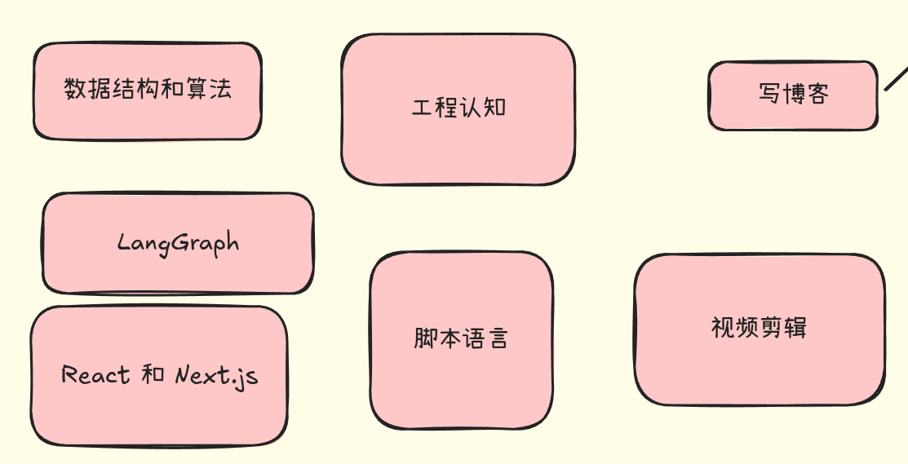

## Table of contents

## 当下需要了解的技能

## 进一步提升的核心模块

要将当前的技能组合进一步升维，从“能够交付产品”提升到“能在市场中持续获胜与商业化”，需要补齐以下 4 个核心模块：

**一、 商业与产品思维（从“开发者”到“创作者/Product Owner”）**

- **需求痛点挖掘**：不从“技术有多炫”出发，而是从“谁在遇到什么痛苦、愿意付多少钱”出发。
- **MVP（最小可行性产品）验证**：用最小的成本（甚至不用写代码）快速测试市场反馈，避免闭门造车 3 个月却没人买单。
- **用户体验 (UX/UI) 敏锐度**：现代产品极度看重交互体验，懂一点基本的 Design System 和用户旅程设计，能让你的技术产出直接提升一个档次。

**二、 运维与云原生（从“本地能跑”到“高可用部署”）**

- **Docker & 容器化**：确保开发、测试和线上环境的绝对一致，解决“在我电脑上能跑”的经典难题。
- **CI/CD & 自动化部署**：通过 GitHub Actions 等工具实现代码 `git push` 后自动运行测试、编译构建并部署到生产环境。
- **Serverless & 边缘计算**：熟悉 Cloudflare Workers、Vercel 等平台，掌握低成本、高并发的轻量级基础设施架构。

**三、 运营与流量获取（从“做出来”到“被看见”）**

- **SEO（搜索引擎优化）与 GEO（生成式引擎优化）**：让你的博客和产品不仅能在 Google/百度 被搜到，也能在 AI 检索中被引用。
- **社交媒体运营 (X/Twitter、小红书、B站等)**：掌握构建公域流量的机制，学会通过“Build in Public”（公开构建）积累早期种子用户。
- **社区与用户沟通**：建立用户反馈通道（如 Discord/Telegram 社区），把一次性用户变成长期支持者。

**四、 数据驱动与商业变现（闭环控制）**

- **产品数据埋点与分析**：使用 PostHog、Google Analytics 等工具，分析用户从哪里来、在哪个步骤流失、最喜欢什么功能。
- **支付与订阅接入**：熟悉 Stripe、Paddle 或国内支付接口的集成，搭建自动化的计费与订阅机制（SaaS 模式）。
- **法律与合规常识**：了解基本的隐私政策 (GDPR)、开源协议选择、商标防范以及个人收款合规问题。

**全景能力架构图**

| **层级**                  | **对应模块**                                               | **解决的核心问题**                        |
| ------------------------- | ---------------------------------------------------------- | ----------------------------------------- |
| **基础能力** *(你已具备)* | 算法、脚本语言、React/Next.js、LangGraph                   | **How to build**（如何把东西做出来）      |
| **工程交付** *(新补充)*   | Docker、CI/CD、Serverless、部署运维                        | **How to run**（如何让系统稳定运行）      |
| **产品方向** *(新补充)*   | 痛点挖掘、MVP验证、UX/UI 设计                              | **What to build**（做真正有价值的东西）   |
| **市场与流量** *(新补充)* | SEO/GEO、社媒运营、Build in Public、视频/博客 *(你已具备)* | **How to reach**（如何获取第一批用户）    |
| **商业闭环** *(新补充)*   | 支付接入、数据埋点分析、合规变现                           | **How to monetize**（如何实现可持续变现） |
